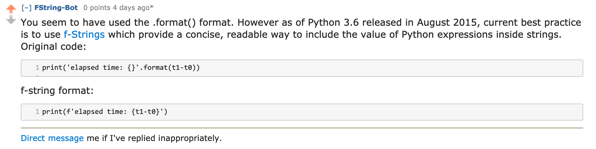

# Steven's Reddit Bots
This is a repository for bots which read comments and posts 
on reddit and give automated replies. 

## The Bots
**[F-String Bot](https://www.reddit.com/user/FString-Bot)**, scans 
[r/learnpython](https://www.reddit.com/r/learnpython/) for replies and new posts in 
for code which could benefit from using f-strings instead of `.format()` statements.
More Python code suggestion features will be added.

**Generic Bot** can be used on a variety of subreddits.
It will scan for certain RegEx specified phrases and give set answers.
The trigger phrases and answers will be imported from a separate CSV file for 
maximum modularity. 

## Todo: F-string Bot
- [ ] Review code on being called with `u/FString-Bot`, instead of just scanning all code?
- [ ] Correct `if var == True:` lines to just 'if var:'
- [ ] Allow for 1 >= corrections in one reply.
- [ ] Scanning replies and posts is currently two separate files. Combine?

## Todo: Generic Bot
- [ ] Is there a way to have it hosted/ leave it running for free?
- [ ] Make a bot that can give static replies to text found in regex format,
from an external CSV table.
- [ ] Delete comment if score becomes -2

## F-String Bot - Challenges/Features

`    return "My favorite song is {} by {}.".format(song, artist)`

In a line such as shown above, some of the things which made this
challenging were:
- The `.format(` section can have:
  - `.format(song, artist)` 
  - or `.format(song = song_name, artist = artist_name)`
- The text can have keys, or just be positional:
  - `return "My favorite song is {} by {}."`
  - `return "My favorite song is {song} by {artist}."`
- The number of variables to be replaced is uncertain
- If it is a `print` statement the ending will have 2 `)` eg `artist_name))`, and so both
should be ignored for capturing variables. 
  - However if the variable has  at the end, t
it needs to be to be captured with the variable and not excluded.
- Just reply once per thread so as to not spam people

